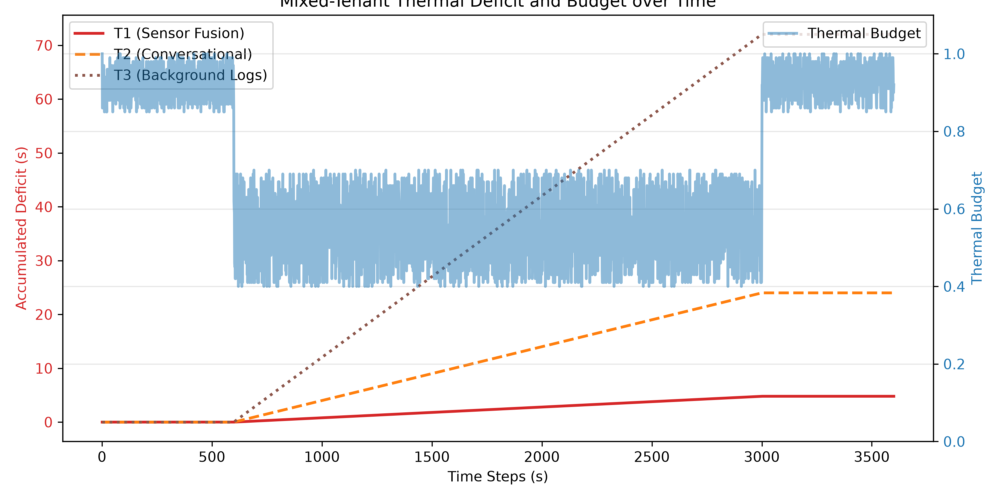
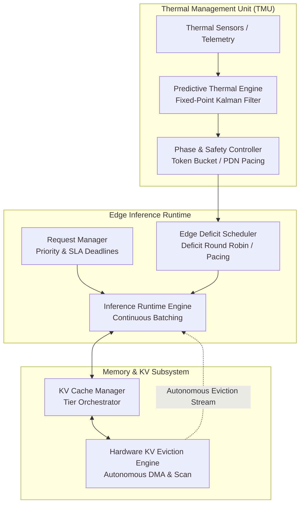

# ⚡ Kairos-Edge: Thermal-Aware Edge Inference


[](./Documentation/Reference/Kairos_Edge_Specification.md)

> 📘 **Technical Architecture & Specification Reference Manual:**  
> For technical details on the microarchitecture, RTL state machines, coupled lateral thermal models, token bucket dynamics, and starvation-freedom proofs, see the [**Kairos-Edge Technical Architecture Reference**](./Documentation/Reference/Kairos_Edge_Architecture.md) and [**Specification Manual**](./Documentation/Reference/Kairos_Edge_Specification.md).

---

## 📌 Overview

This repository contains **Kairos-Edge**, a hardware/software co-designed framework for memory-efficient and thermally aware LLM inference on constrained edge devices.

Running generative transformer models on edge platforms (embedded SoCs, robotics compute boards, autonomous gateways) encounters two tightly coupled physical bottlenecks: memory capacity limits caused by exploding Key-Value (KV) cache footprints, and thermal throttling under sustained prompt and decode phases. Standard reactive thermal throttling abruptly degrades token generation throughput, creating multi-second tail latency spikes when temperature thresholds are crossed. Concurrently, standard software-managed KV cache eviction triggers host CPU interrupt stalls and memory bus contention.

Kairos-Edge addresses these challenges through a co-designed architecture that pairs an autonomous hardware KV eviction engine with a predictive Thermal Management Unit (TMU). Operating across hardware RTL and runtime scheduler layers, Kairos-Edge tracks KV reuse distances, forecasts thermal trends using fixed-point telemetry modeling, executes asynchronous memory evictions via DMA, and schedules tokens through a thermal deficit budget to maintain real-time SLA deadlines without thermal throttling collapse.

<p align="center">
  
</p>

---

## 📐 Architecture Diagram



---

## 📊 Hardware & Emulation Metrics

The architecture has been evaluated across SystemVerilog RTL simulation and trace-driven workload emulation across three representative edge scenarios:
* **W1 (AIoT Sensor Fusion):** Continuous bursty prompt ingestion (SLA = 50 ms).
* **W2 (Conversational Assistant):** Interactive low-latency queries (SLA = 100 ms).
* **W3 (Mixed-Tenant Edge):** Critical alerts co-located with background log processing (SLA = 500 ms).

### Workload Performance Comparison

| Workload | Metric | Reactive Baseline | Kairos-Edge | Notes / Improvement |
| :--- | :--- | :---: | :---: | :--- |
| **W1 Sensor Fusion** | TBT P95 Latency | 0.18 s | **0.05 s** | 72.2% reduction in tail latency |
| | Energy per Token | 2.96 J | **1.07 J** | 63.8% energy reduction |
| **W2 Conversational** | TBT P95 Latency | 0.20 s | **0.07 s** | 65.0% reduction in tail latency |
| | Energy per Token | 2.89 J | **1.25 J** | 56.7% energy reduction |
| **W3 Mixed-Tenant** | TBT P95 Latency | 0.23 s | **0.10 s** | 56.5% reduction in tail latency |
| | Energy per Token | 4.18 J | **2.24 J** | 46.4% energy reduction |

### Hardware Block Simulation

| Component | Metric | Software Baseline | Hardware Native | Delta / Notes |
| :--- | :--- | :---: | :---: | :--- |
| **HW KV Eviction Engine** | Eviction Latency | 4,645 cycles | **35 cycles** | 99.2% cycle reduction (`hw_kv/tb_hw_kv_eviction.sv`) |
| | Host CPU Interrupts | Multiple per page | **0** | Autonomous DMA transfer |
| **TMU Safety Controller** | Coalesced Interrupts | N/A | **255** | Safety bypass queue (`hw_tmu/test_safety_bypass.py`) |

---

## ✨ Key Features

### ✔ Hardware KV Eviction
* **Autonomous DMA Scanning:** The SystemVerilog eviction engine (`hw_kv/hw_kv_eviction_engine.sv`) monitors memory pressure and scans page table entries without requiring host CPU trap handlers.
* **Reuse-Distance Metadata:** Implements hardware-tracked access counters to identify cold pages, streaming selected candidate blocks to secondary storage across DMA channels.

### ✔ Predictive Thermal Management
* **Trend Forecasting:** Fixed-point telemetry prediction evaluates thermal trajectories to detect imminent limit violations before reactive DVFS throttles clocks.
* **Safety Bypass:** Out-of-band fabric protocol testbench and emulator (`hw_tmu/tmu_oob_fabric_tb.sv`, `hw_tmu/test_safety_bypass.py`) coalesce non-critical thermal telemetry while ensuring critical thermal interrupt events bypass pipeline stalls.

### ✔ Phase-Aware Scheduling
* **Prefill vs. Decode Disaggregation:** Classifies requests into compute-heavy prefill bursts and memory-bandwidth-bound token decode phases.
* **PDN Pacing:** Smooths token dispatch transitions across phase boundaries to mitigate power delivery network (PDN) voltage droop and prevent thermal overshoot.

### ✔ Thermal Deficit Scheduling
* **Deficit Round Robin (DRR):** Maintains per-tenant token bucket quotas based on real-time thermal headroom (`core/thermal_token_bucket.py`).
* **SLA Preservation:** During acute thermal excursions, background workloads absorb necessary throttles so high-priority interactive tasks maintain target latency.

### ✔ Edge Inference Simulation
* **End-to-End Test Harness:** Python-based simulation drivers (`scripts/run_benchmark.py`, `kairos_gpu_locality_sim/`) emulate multi-tenant arrival traces, memory tiering events, and thermal feedback loops.

---

## 🚀 Verification & Results

The repository includes both Python verification testbenches and SystemVerilog RTL simulations.

### 1. Python Unit Tests
Run the test suite verifying core components (token bucket, safety fallbacks, KV managers):
```bash
python -m unittest tests/test_level2_components.py
```

### 2. TMU Safety Bypass Verification
Run the event queue and out-of-band fabric emulator:
```bash
python hw_tmu/test_safety_bypass.py
```

### 3. Thermal Deficit Analysis Plotting
Regenerate the thermal deficit trajectory plot from benchmark logs:
```bash
python scripts/plot_l5.py
```

### 4. Hardware RTL Simulation
The SystemVerilog testbenches in `hw_kv/` and `hw_tmu/` can be simulated using standard IEEE 1800 SystemVerilog simulators (such as Icarus Verilog or Vivado/ModelSim):
```bash
# Simulating Hardware KV Eviction Engine
iverilog -g2012 -o sim_kv hw_kv/hw_kv_eviction_engine.sv hw_kv/tb_hw_kv_eviction.sv
vvp sim_kv

# Simulating TMU Thermal Controller
iverilog -g2012 -o sim_tmu hw_tmu/rtl/Kairos_Thermal_Controller.v hw_tmu/tb/tb_Kairos_Thermal_Controller.sv
vvp sim_tmu
```

---

## 📂 Directory Structure

```text
Kairos-Edge/
├── Documentation/
│   └── Reference/              # Technical specifications, architecture, and evaluation
├── Images/                     # Performance plots and system figures
├── configs/                    # Workload configurations (W1, W2, W3) and power limits
├── core/                       # Thermal token bucket, KV policies, and request manager
├── hw_kv/                      # SystemVerilog hardware KV eviction engine & testbenches
├── hw_tmu/                     # Thermal Management Unit RTL, fabric emulator & tests
├── kairos_gpu_locality_sim/    # GPU locality and memory hierarchy simulator
├── logs/                       # Trace logs and benchmark evaluation reports
├── scripts/                    # Benchmark orchestration and emulation scripts
├── tests/                      # Python unit tests for scheduling and KV logic
├── .gitignore
├── LICENSE
└── README.md
```

---

## ⚖️ License

This project is licensed under the MIT License. See [LICENSE](LICENSE).
